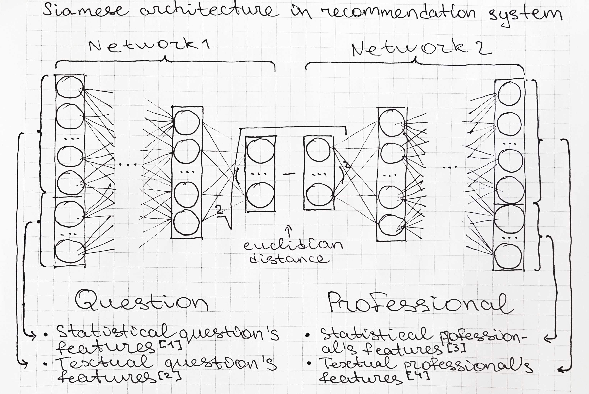
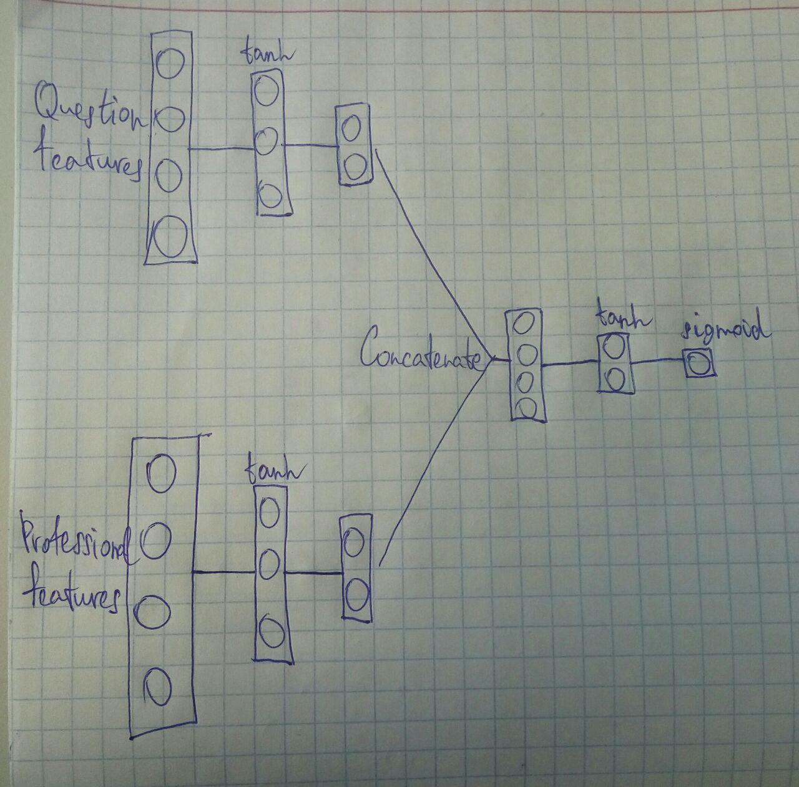
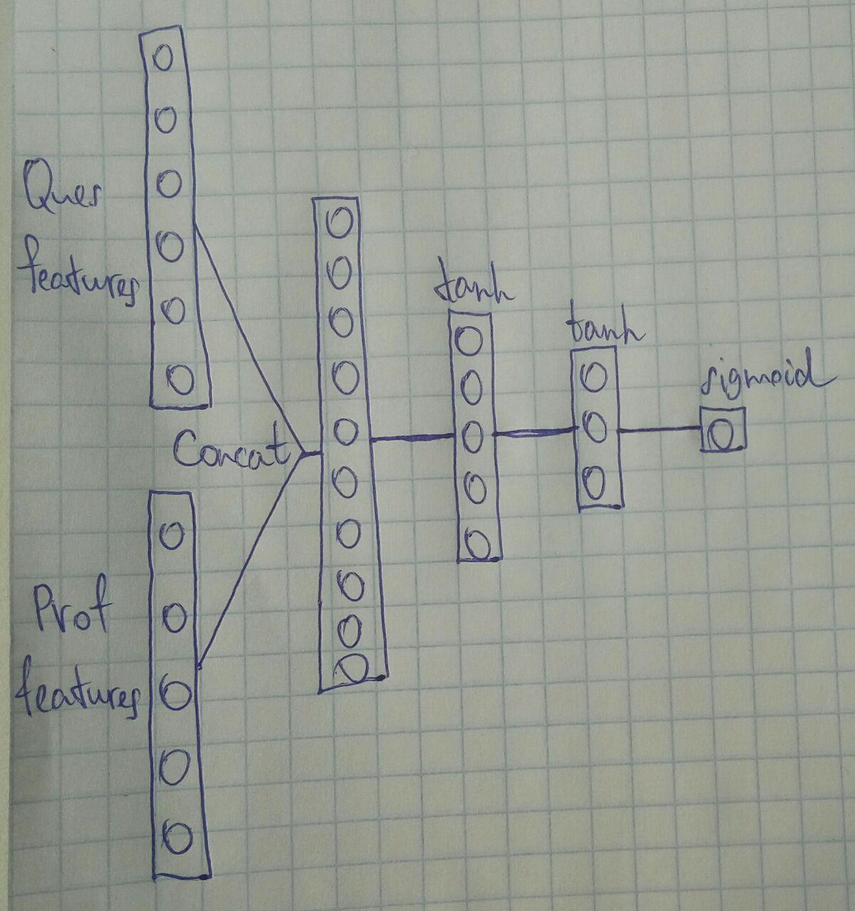
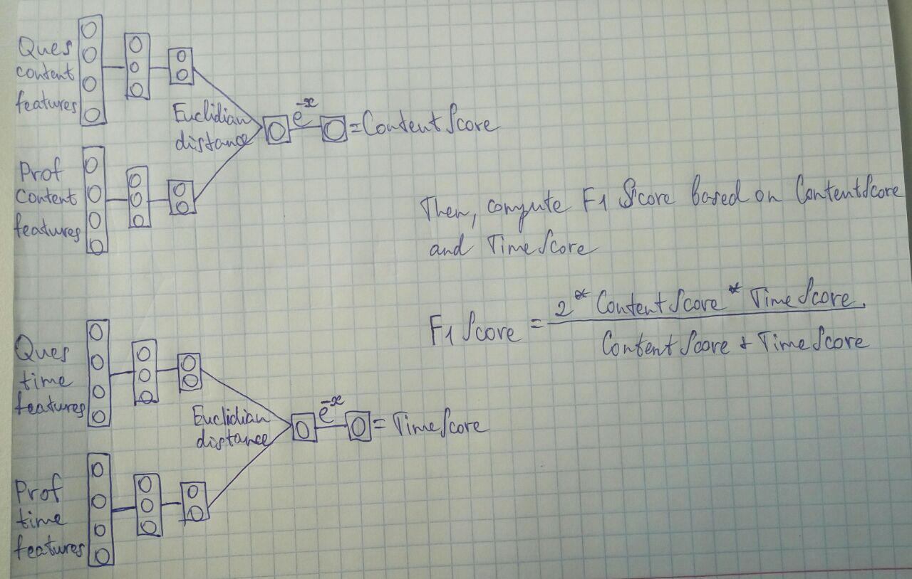

# Model Architecture Summary

While trying to find the best model for CareerVillage recommendations, we came up with the following model architectures:

- ## Siamese Architecture

We begin with a single vector respesentation separately for question and professional features. We pass each of these vectors through similar in arhitecture neural networks to get lower-dimensional *latent space representations* for question and professional. Then, we compute the euclidian distance between these representations to get a single number x, to with we apply *exp(-x)* loss function.

- ## Encoder Architecture

This architecture begins with a latent space representation block which is the same as in Siamese architecture, but then, instead of computing the distance between latent vectors, we concatenate them and process by several additional Dense layers before making the prediction.

- ## Simple architecture

This architecture is different from the previous two. Here, instead of computing n-dimensional latent space representations for question and P features, we simply concatenate these features from the beginning, and then pass this feature vector through several Dense layer before making a prediction.

---

### Training Method
All preceding architectures are trained on equal number of positive and negative pairs. The pair is positive if a given question was answered by a given professional, and is negative otherwise.

### Interesting Use Cases
What we found out is that three models above give approximately the same accuracy, so we decided to stick with Siamese architecture, as it would allow us to precompute question and professional latent space representations and store them. They can be used in production to quickly find appropriate professionals for the new question by computing its latent vector and measuring distance from stored professional latent vectors to find the closest ones. Another idea is to find similar questions for the new one and suggest cheking them out first before publishing the new question.

### Overemphasizing Time-related Features
One big problem we encountered is that due to our random choice of negative pairs, all models above overemphasize time-related features, making the importance of content-related features negligible.

Our solution to this problem is building two separate Siamese models trained on content- and time-related features respectively, and then combining their predictions using F1 score.  

This way, the contribution to the overall score is equal from content- and time-related features.  
In production, when we receive the new question, we notify professionals who result in highest overall scores.
